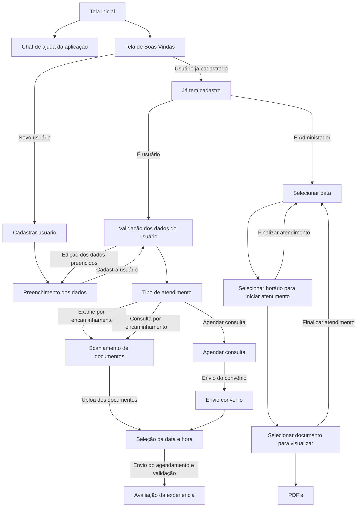

# Informações do Projeto

`TÍTULO DO PROJETO`  

## Agendaí

`CURSO`

### Sistemas de Informação

## Participantes
>
> Os membros do grupo são:
>
> - Christian Sena Gomes
> - Felipe dos Santos Resende
> - João Pedro Rafael Santos Silva
> - Kayque dos Santos Almeida
> - Yuri Zocoli Silva

# Estrutura do Documento

- [Informações do Projeto](#informações-do-projeto)
  - [Participantes](#participantes)
- [Estrutura do Documento](#estrutura-do-documento)
- [Introdução](#introdução)
  - [Problema](#problema)
  - [Objetivos](#objetivos)
  - [Justificativa](#justificativa)
  - [Público-Alvo](#público-alvo)
- [Especificações do Projeto](#especificações-do-projeto)
  - [Personas e Mapas de Empatia](#personas-e-mapas-de-empatia)
  - [Histórias de Usuários](#histórias-de-usuários)
  - [Requisitos](#requisitos)
    - [Requisitos Funcionais](#requisitos-funcionais)
    - [Requisitos não Funcionais](#requisitos-não-funcionais)
  - [Restrições](#restrições)
- [Projeto de Interface](#projeto-de-interface)
  - [User Flow](#user-flow)
  - [Wireframes](#wireframes)
- [Metodologia](#metodologia)
  - [Divisão de Papéis](#divisão-de-papéis)
  - [Ferramentas](#ferramentas)
  - [Controle de Versão](#controle-de-versão)
<!-- - [**############## SPRINT 1 ACABA AQUI #############**](#-sprint-1-acaba-aqui-)
- [Projeto da Solução](#projeto-da-solução)
  - [Tecnologias Utilizadas](#tecnologias-utilizadas)
  - [Arquitetura da solução](#arquitetura-da-solução)
- [Avaliação da Aplicação](#avaliação-da-aplicação)
  - [Plano de Testes](#plano-de-testes)
  - [Ferramentas de Testes (Opcional)](#ferramentas-de-testes-opcional)
  - [Registros de Testes](#registros-de-testes)
- [Referências](#referências)
 -->

# Introdução

## Problema

Atualmente, o processo de agendamento de consultas médicas em muitos centros de saúde é marcado por uma série de desafios que comprometem a experiência tanto de pacientes quanto de profissionais de saúde. Entre os principais problemas identificados estão:

Filas de Espera Excessivas: Pacientes frequentemente enfrentam longas esperas para agendar consultas, o que pode atrasar o acesso a cuidados médicos necessários.
Conflitos de Horários: A falta de visibilidade e controle sobre os horários disponíveis leva a conflitos e dificuldades em encontrar horários convenientes tanto para pacientes quanto para profissionais.
Dificuldade de Acesso: Muitos pacientes têm dificuldades em acessar o sistema de agendamento, seja por limitações tecnológicas ou falta de clareza nas informações.
Faltas e Atrasos: A ausência de um sistema eficiente resulta em um número significativo de faltas e atrasos, afetando a programação diária e a disponibilidade de atendimento.
Processo Manual Suscetível a Erros: O uso de processos manuais para agendamento aumenta o risco de erros, como agendamentos duplicados ou perdidos.
Falta de Transparência e Controle: A ausência de um sistema centralizado para gerenciamento de agendamentos dificulta o controle e a transparência sobre o processo, levando a uma insatisfação geral.
Esses problemas não só atrasam o atendimento médico necessário, mas também resultam em baixa eficiência operacional e insatisfação geral, destacando a urgência em desenvolver soluções inovadoras para modernizar o processo de agendamento de consultas médicas.

<!-- > **Links Úteis**:
>
> - [Objetivos, Problema de pesquisa e Justificativa](https://medium.com/@versioparole/objetivos-problema-de-pesquisa-e-justificativa-c98c8233b9c3)
> - [Matriz Certezas, Suposições e Dúvidas](https://medium.com/educa%C3%A7%C3%A3o-fora-da-caixa/matriz-certezas-suposi%C3%A7%C3%B5es-e-d%C3%BAvidas-fa2263633655)
> - [Brainstorming](https://www.euax.com.br/2018/09/brainstorming/) -->

## Objetivos

O principal objetivo deste projeto é desenvolver e implementar um sistema de agendamento de consultas médicas eficiente e automatizado, visando reduzir os problemas atualmente enfrentados por pacientes e profissionais de saúde em centros de saúde. Esse sistema buscará otimizar o processo de agendamento, aumentar a satisfação dos usuários, melhorar o acesso aos serviços de saúde e elevar a eficiência operacional dos centros de saúde.

<!-- >
> **Links Úteis**:
>
> - [Objetivo geral e objetivo específico: como fazer e quais verbos utilizar](https://blog.mettzer.com/diferenca-entre-objetivo-geral-e-objetivo-especifico/) -->

## Justificativa

A necessidade de um sistema de agendamento de consultas médicas mais eficiente é evidente diante dos desafios e inconvenientes enfrentados tanto por pacientes quanto por profissionais de saúde nos métodos tradicionais de agendamento. Filas de espera longas, conflitos de horários, acessibilidade limitada, faltas e atrasos frequentes, e o risco de erros em processos manuais não apenas diminuem a qualidade do atendimento ao paciente, mas também impactam negativamente a eficiência operacional dos centros de saúde. Além disso, a falta de transparência e controle no processo atual de agendamento contribui para a insatisfação geral. A implementação de um sistema automatizado oferece uma solução potencial para esses problemas, promovendo uma experiência mais positiva para todos os envolvidos.

<!-- >
> **Links Úteis**:
>
> - [Como montar a justificativa](https://guiadamonografia.com.br/como-montar-justificativa-do-tcc/) -->

## Público-Alvo

### Pacientes

Este grupo inclui indivíduos que buscam agendar consultas médicas de forma prática e eficiente. Eles podem variar em idade, condição socioeconômica e familiaridade com a tecnologia. Os pacientes buscam um sistema que minimize o tempo de espera, ofereça flexibilidade para escolha de horários e facilite o acesso a informações sobre profissionais de saúde e serviços disponíveis.

### Profissionais de Saúde (Médicos, Enfermeiros, e outros)

Os profissionais de saúde são usuários críticos do sistema, que buscam otimizar seu tempo de trabalho e melhorar a qualidade do atendimento ao paciente. Eles necessitam de uma ferramenta que facilite a visualização e gestão de suas agendas, permita ajustes fáceis em horários, e ofereça informações atualizadas sobre os pacientes.

### Administradores de Clínicas e Hospitais

Este perfil inclui gestores e administradores responsáveis pela operação e administração de clínicas e hospitais. Eles procuram um sistema que ofereça uma visão geral eficiente das agendas de todos os profissionais, facilite o gerenciamento de recursos, e forneça dados analíticos para suporte à tomada de decisões.

### Equipe de Suporte Técnico

A equipe de suporte técnico desempenha um papel vital na manutenção e no bom funcionamento do sistema. Esse grupo é composto por profissionais de TI que precisam de acesso a ferramentas de diagnóstico e manutenção, além de documentação técnica detalhada para resolver problemas e realizar atualizações no sistema de forma eficaz.

### Famílias e Cuidadores

Embora não sejam usuários diretos, as famílias e cuidadores dos pacientes desempenham um papel importante no processo de agendamento de consultas. Eles muitas vezes auxiliam pacientes idosos, crianças, ou indivíduos com necessidades especiais no agendamento de consultas médicas. Este grupo busca um sistema acessível e fácil de usar que permita agendar consultas em nome de outra pessoa, garantindo o cuidado adequado aos seus entes queridos

<!-- >
> **Links Úteis**:
>
> - [Público-alvo: o que é, tipos, como definir seu público e exemplos](https://klickpages.com.br/blog/publico-alvo-o-que-e/)
> - [Qual a diferença entre público-alvo e persona?](https://rockcontent.com/blog/diferenca-publico-alvo-e-persona/) -->

## Especificações do Projeto

O projeto busca resolver alguns problemas no setor da saúde com relação a marcação de horários, filas de espera e conflitos de agendamentos.

A aplicação busca gerenciar agendamentos para que não haja sobreposição de horários, ou outros erros que pessoas estão sujeitas a cometer, criar controle para as pessoas que fazem agendamento acompanharem seus horários e receberem feedbacks sobre vagas e consultas com maior facilidade, tirando a necessidade de um trabalho manual para isso.

## Personas e Mapas de Empatia

#### **Marcelo Ferraz**
  
---

#### **Pedro**
  
---

### **Marina**
  

## Histórias de Usuários

Com base na análise das personas forma identificadas as seguintes histórias de usuários:

|EU COMO... `PERSONA`| QUERO/PRECISO ... `FUNCIONALIDADE`             |PARA ... `MOTIVO/VALOR`                                           |
|--------------------|------------------------------------------------|------------------------------------------------------------------|
|Marcelo Ferraz      | Agendar consultas online                       | Para economizar tempo evitando o deslocamento até a clinica      |
|Pedro               | Selecionar uma clínica/hospital de preferência | Para escolher o local mais adequado para mim                     |
|Marina              | Gerir as consultas por meio da internet        | Para facilitar a gestão das consultas e otimizar meu trabalho    |
|Marcelo Ferraz      | Marcar consultas em horário e dia especifico   | Para se adequar à minha rotina                                   |
|Marcelo Ferraz      | Escolher um médico de preferência              | Para ser atendido por um médico que me recomendaram ou conhecido |
|Pedro               | Confirmação de dados durante o agendamento     | Para evitar a entrada de dados incorretos                        |

## Requisitos

As tabelas que se seguem apresentam os requisitos funcionais e não funcionais que detalham o escopo do projeto.

### Requisitos Funcionais

|ID    | Descrição do Requisito  | Prioridade |
|------|-----------------------------------------|----|
|RF-001| Permitir que o usuário faça login | ALTA |
|RF-002| Permitir que o usuário faça cadastro | ALTA |
|RF-003| Permitir que o usuário visualize o cadastro | ALTA |
|RF-004| Permitir que o usuário valide os dados | ALTA |
|RF-005| Permitir que o usuário edite os dados | ALTA |
|RF-006| Permitir que o usuário selecione o tipo de atendimento | ALTA |
|RF-007| Permitir que o usuário  envie carteira do convenio | ALTA |
|RF-008| Permitir que o usuário  envie pedido médico | ALTA |
|RF-009| Permitir que o usuário selecione o tipo de atendimento | BAIXA |
|RF-010| Permitir que o usuário selecione a especialidade | MÉDIA |
|RF-011| Permitir que o usuário selecione a clinica de preferência | ALTA |
|RF-012| Permitir que o usuário selecione a profissional de preferência | MÉDIA |
|RF-013| Permitir que o usuário selecione uma data | ALTA |
|RF-014| Permitir que o usuário selecione um horário | ALTA |
|RF-015| Permitir que o usuário selecione avalie o atendimento | BAIXA |
|RF-016| Permitir que o usuário administrador selecione uma data para atendimento| BAIXA |
|RF-017| Permitir que o usuário administrador selecione um horário para dar inicio ao atendimento| BAIXA |
|RF-018| Permitir que o usuário administrador finalize o atendimento| BAIXA |
|RF-019| Permitir que o usuário administrador selecione e visualize os arquivos do paciente | BAIXA |

### Requisitos não Funcionais

|ID     | Descrição do Requisito  |Prioridade |
|-------|-------------------------|----|
|RNF-001| O sistema deve ser responsivo para rodar em um dispositivos móvel  | MÉDIA |
|RNF-002| O sistema deve ser hospedado no github pages | MÉDIA |
|RNF-003| O sistema deve funcionar também como PWA | BAIXA |
|RNF-004| O sistema deve garantir a segurança dos dados através de criptografia SSL/TLS | ALTA |
|RNF-005| O sistema deve ter um tempo de resposta inferior a 2 segundos para qualquer transação | ALTA |
|RNF-006| O sistema deve suportar pelo menos 1000 usuários simultâneos sem degradação de desempenho | ALTA |

## Restrições

O projeto está restrito pelos itens apresentados na tabela a seguir.

|ID| Restrição                                             |
|--|-------------------------------------------------------|
|01| O projeto deverá ser entregue até o final do semestre |
|02| Não pode ser desenvolvido um módulo de backend        |

# Projeto de Interface

O projeto de interface do sistema de agendamento de consultas médicas foi cuidadosamente desenvolvido para oferecer uma experiência de usuário intuitiva e acessível. Priorizamos uma navegação clara e simples, com menus bem organizados e botões de ação evidentes, garantindo que usuários de todas as idades e habilidades tecnológicas possam utilizar o sistema sem dificuldades. A interface é responsiva, adaptando-se perfeitamente a diferentes dispositivos e tamanhos de tela, o que é essencial para garantir o acesso universal. Além disso, utilizamos cores suaves e ícones explicativos para facilitar a identificação rápida das funções disponíveis, como agendar, reagendar ou cancelar consultas, contribuindo para uma gestão eficiente do tempo tanto dos pacientes quanto dos profissionais de saúde.

## User Flow

## Wireframes
Fluxos de uso:
  - Fluxo de agendamento de consulta
    - Login e validação
    - Seleção do tipo de atendimento
    - Agendar uma consulta
    - Agendamento 
    - Seleção de data
    - Agendar um exame
    - Consulta por encaminhamento médico
    - Envio de documentos
  - Fluxo de horários do médico/clinica
    - Seleção data
    - Seleção de horário
    - Selecione documento para visualização
    - PDFs de paciente

### Fluxo Agendamento
#### **Tela inicial**
 

#### **Tela de opção de cadastro ou login**
 

#### **Tela de login** 
Identificação do tipo de usuário para enviar para a tela correta 
- Administardor - Tela de horários e consultas
- Usuario - tela de agendamento e cadastro

#### **Tela de cadastro de Usuário** 
Inserção dos dados de usuário para cadastro

#### **Validação dos dados** 
Validação dos dados inseridos da tela de cadastro para verificação das informações

#### **Seleção do tipo de atendimento** 
Usuário seleciona o tipo de atendimento que vai continuar.
 - Agendamento de consulta
 - Agendamento de exame
 - Agendamento de consulta por encaminhamento médico

#### **Envio de documentos** 
 Envio dos documentos da consula de encaminhamento
 - Carterinha de convênio
 - Enviar pedido médico do encaminhamento
 

#### **Agendar consulta sem encaminhamento** 
 Seleção do agendamento de consulta sem encaminhamento
 - Tipo de agendamento
 - Especialidade desejada
 - Clinica de preferência (Opcional)
 - Profissional de preferência (Opcional)
 

#### **Horários disponíveis** 
 Seleção do dia e horário disponiveis
 - Seleção da data disponível desejada
 - Seleção do horário disponível desejado
 

#### **Avaliação** 
 Avaliação de experiência do atendimento
 

### Fluxo Clinica/Médico
#### **Avaliação** 
 Avaliação de experiência do atendimento
 

# Metodologia

No desenvolvimento do nosso projeto, adotamos uma abordagem ágil utilizando o framework Scrum, complementado pelo processo de Design Thinking. Utilizamos cerimônias do Scrum como Sprint Planning e mantivemos o foco nas necessidades dos usuários através de etapas de empatia, definição e ideação. Para gerenciar e rastrear nosso progresso, empregamos ferramentas como Github Projects, utilizamos o GitHub para a gestão de configuração do projeto, utilizamos o WhatsApp e Discord para comunicação e votação de funcionalidades.

A divisão dos status de atividades foram:

  - Todo: Tarefas que ainda não foram iniciadas.
  - In Progress: Tarefas que foram iniciadas e estão sendo executadas.
  - Inpedment: Tarefas que foram iniciadas, mas por algum motivo tem algo bloqueando sua conclusão.
  - Done: Tarefas que foram concluídas.

## Divisão de Papéis

As tarefas foram levantas em conjunto e divididas sob demanda na maior parte do tempo, mas inicialmente foi dividido por uma votação de tarefas levando em consideração a complexidade de cada tarefa, e as habilidades de cada integrante.

Kayque: Apresentação do Trabalho e Slides. Mapa de Stakeholders.
Talles: Mural de possibidades, Proposta de Valor e Mapa de Priorização.
Christian: Diagrama de personas, Entrevista Qualitativa, Estórias de Usuário.
Yuri: Entrevista Qualitativa, Highlits de Pesquisa.
João: Wireframes, Matriz CSD, Relatório tecnico, Contexto do Projeto, Projeto de Interface, Fluxo de Usuário.

Todos: BrainStorm

## Ferramentas

| Ambiente  | Plataforma              |Link de Acesso |
|-----------|-------------------------|---------------|
|Processo de Design Thinkgin  | Miro |  <https://miro.com/app/board/uXjVNjO9Ezo=/> |
|Repositório de código | GitHub | <https://github.com/ICEI-PUC-Minas-PCO-SI/pco-si-2024-1-tiaw-agendamento-de-consultas> |
|Hospedagem do site | Heroku |  <https://XXXXXXX.herokuapp.com> |
|Protótipo Interativo |  Figma | [Figma](https://www.figma.com/proto/FTo5F6hFRDaLCtbXbtlQYt/Untitled?type=design&node-id=1-2&scaling=min-zoom&page-id=0%3A1&starting-point-node-id=1%3A2&show-proto-sidebar=1>) |

## Controle de Versão

>
> O projeto segue a seguinte convenção para o nome de branchs:
>
> - `main`: versão estável já testada do software
> - `feature-#`: funcionalidade em desenvolvimento
> - `dev`: versão de desenvolvimento do software
> - `bugfix`: Correção de erro em teste
> - `hotfix`: Correção de erro em produção
>

<!--
# **############## SPRINT 1 ACABA AQUI #############**
# Projeto da Solução

......  COLOQUE AQUI O SEU TEXTO ......

## Tecnologias Utilizadas

......  COLOQUE AQUI O SEU TEXTO ......

> Descreva aqui qual(is) tecnologias você vai usar para resolver o seu
> problema, ou seja, implementar a sua solução. Liste todas as
> tecnologias envolvidas, linguagens a serem utilizadas, serviços web,
> frameworks, bibliotecas, IDEs de desenvolvimento, e ferramentas.
> Apresente também uma figura explicando como as tecnologias estão
> relacionadas ou como uma interação do usuário com o sistema vai ser
> conduzida, por onde ela passa até retornar uma resposta ao usuário.
>
> Inclua os diagramas de User Flow, esboços criados pelo grupo
> (stoyboards), além dos protótipos de telas (wireframes). Descreva cada
> item textualmente comentando e complementando o que está apresentado
> nas imagens.

## Arquitetura da solução

......  COLOQUE AQUI O SEU TEXTO E O DIAGRAMA DE ARQUITETURA .......

> Inclua um diagrama da solução e descreva os módulos e as tecnologias
> que fazem parte da solução. Discorra sobre o diagrama.
>
> **Exemplo do diagrama de Arquitetura**:
>
> 

# Avaliação da Aplicação

......  COLOQUE AQUI O SEU TEXTO ......

> Apresente os cenários de testes utilizados na realização dos testes da
> sua aplicação. Escolha cenários de testes que demonstrem os requisitos
> sendo satisfeitos.

## Plano de Testes

......  COLOQUE AQUI O SEU TEXTO ......

> Enumere quais cenários de testes foram selecionados para teste. Neste
> tópico o grupo deve detalhar quais funcionalidades avaliadas, o grupo
> de usuários que foi escolhido para participar do teste e as
> ferramentas utilizadas.
>
> **Links Úteis**:
>
> - [IBM - Criação e Geração de Planos de Teste](https://www.ibm.com/developerworks/br/local/rational/criacao_geracao_planos_testes_software/index.html)
> - [Práticas e Técnicas de Testes Ágeis](http://assiste.serpro.gov.br/serproagil/Apresenta/slides.pdf)
> - [Teste de Software: Conceitos e tipos de testes](https://blog.onedaytesting.com.br/teste-de-software/)

## Ferramentas de Testes (Opcional)

......  COLOQUE AQUI O SEU TEXTO ......

> Comente sobre as ferramentas de testes utilizadas.
>
> **Links Úteis**:
>
> - [Ferramentas de Test para Java Script](https://geekflare.com/javascript-unit-testing/)
> - [UX Tools](https://uxdesign.cc/ux-user-research-and-user-testing-tools-2d339d379dc7)

## Registros de Testes

......  COLOQUE AQUI O SEU TEXTO ......

> Discorra sobre os resultados do teste. Ressaltando pontos fortes e
> fracos identificados na solução. Comente como o grupo pretende atacar
> esses pontos nas próximas iterações. Apresente as falhas detectadas e
> as melhorias geradas a partir dos resultados obtidos nos testes.

# Referências

......  COLOQUE AQUI O SEU TEXTO ......

> Inclua todas as referências (livros, artigos, sites, etc) utilizados
> no desenvolvimento do trabalho.
>
> **Links Úteis**:
>
> - [Formato ABNT](https://www.normastecnicas.com/abnt/trabalhos-academicos/referencias/)
=======

# Informações do Projeto

`TÍTULO DO PROJETO`  

......  COLOQUE AQUI O SEU TEXTO ......

`CURSO`

......  COLOQUE AQUI O SEU TEXTO ......

## Participantes

......  COLOQUE AQUI O SEU TEXTO ......

> Inclua a lista dos membros da equipe com seus nomes completos.
>
> Os membros do grupo são:
>
> - Fulano da Silva
> - Ciclano Albuquerque

# Estrutura do Documento

- [Informações do Projeto](#informações-do-projeto)
  - [Agendaí](#agendaí)
    - [Sistemas de Informação](#sistemas-de-informação)
  - [Participantes](#participantes)
- [Estrutura do Documento](#estrutura-do-documento)
- [Introdução](#introdução)
  - [Problema](#problema)
  - [Objetivos](#objetivos)
  - [Justificativa](#justificativa)
  - [Público-Alvo](#público-alvo)
    - [Pacientes](#pacientes)
    - [Profissionais de Saúde (Médicos, Enfermeiros, e outros)](#profissionais-de-saúde-médicos-enfermeiros-e-outros)
    - [Administradores de Clínicas e Hospitais](#administradores-de-clínicas-e-hospitais)
    - [Equipe de Suporte Técnico](#equipe-de-suporte-técnico)
    - [Famílias e Cuidadores](#famílias-e-cuidadores)
  - [Especificações do Projeto](#especificações-do-projeto)
  - [Personas e Mapas de Empatia](#personas-e-mapas-de-empatia)
  - [Histórias de Usuários](#histórias-de-usuários)
  - [Requisitos](#requisitos)
    - [Requisitos Funcionais](#requisitos-funcionais)
    - [Requisitos não Funcionais](#requisitos-não-funcionais)
  - [Restrições](#restrições)
- [Projeto de Interface](#projeto-de-interface)
  - [User Flow](#user-flow)
  - [Wireframes](#wireframes)
- [Metodologia](#metodologia)
  - [Divisão de Papéis](#divisão-de-papéis)
  - [Ferramentas](#ferramentas)
  - [Controle de Versão](#controle-de-versão)
- [**############## SPRINT 1 ACABA AQUI #############**](#-sprint-1-acaba-aqui-)
- [Projeto da Solução](#projeto-da-solução)
  - [Tecnologias Utilizadas](#tecnologias-utilizadas)
  - [Arquitetura da solução](#arquitetura-da-solução)
- [Avaliação da Aplicação](#avaliação-da-aplicação)
  - [Plano de Testes](#plano-de-testes)
  - [Ferramentas de Testes (Opcional)](#ferramentas-de-testes-opcional)
  - [Registros de Testes](#registros-de-testes)
- [Referências](#referências)
- [Informações do Projeto](#informações-do-projeto-1)
  - [Participantes](#participantes-1)
- [Estrutura do Documento](#estrutura-do-documento-1)
- [Introdução](#introdução-1)
  - [Problema](#problema-1)
  - [Objetivos](#objetivos-1)
  - [Justificativa](#justificativa-1)
  - [Público-Alvo](#público-alvo-1)
- [Especificações do Projeto](#especificações-do-projeto-1)
  - [Personas, Empatia e Proposta de Valor](#personas-empatia-e-proposta-de-valor)
  - [Histórias de Usuários](#histórias-de-usuários-1)
  - [Requisitos](#requisitos-1)
    - [Requisitos Funcionais](#requisitos-funcionais-1)
    - [Requisitos não Funcionais](#requisitos-não-funcionais-1)
  - [Restrições](#restrições-1)
- [Projeto de Interface](#projeto-de-interface-1)
  - [User Flow](#user-flow-1)
  - [Wireframes](#wireframes-1)
- [Metodologia](#metodologia-1)
  - [Divisão de Papéis](#divisão-de-papéis-1)
  - [Ferramentas](#ferramentas-1)
  - [Controle de Versão](#controle-de-versão-1)
- [**############## SPRINT 1 ACABA AQUI #############**](#-sprint-1-acaba-aqui--1)
- [Projeto da Solução](#projeto-da-solução-1)
  - [Tecnologias Utilizadas](#tecnologias-utilizadas-1)
  - [Arquitetura da solução](#arquitetura-da-solução-1)
- [Avaliação da Aplicação](#avaliação-da-aplicação-1)
  - [Plano de Testes](#plano-de-testes-1)
  - [Ferramentas de Testes (Opcional)](#ferramentas-de-testes-opcional-1)
  - [Registros de Testes](#registros-de-testes-1)
- [Referências](#referências-1)

# Introdução

## Problema

......  COLOQUE AQUI O SEU TEXTO ......

> Nesse momento você deve apresentar o problema que a sua aplicação deve
> resolver. No entanto, não é a hora de comentar sobre a aplicação.
> Descreva também o contexto em que essa aplicação será usada, se
> houver: empresa, tecnologias, etc. Novamente, descreva apenas o que de
> fato existir, pois ainda não é a hora de apresentar requisitos
> detalhados ou projetos.
>
> Nesse momento, o grupo pode optar por fazer uso
> de ferramentas como Design Thinking, que permite um olhar de ponta a
> ponta para o problema.
>
> **Links Úteis**:
>
> - [Objetivos, Problema de pesquisa e Justificativa](https://medium.com/@versioparole/objetivos-problema-de-pesquisa-e-justificativa-c98c8233b9c3)
> - [Matriz Certezas, Suposições e Dúvidas](https://medium.com/educa%C3%A7%C3%A3o-fora-da-caixa/matriz-certezas-suposi%C3%A7%C3%B5es-e-d%C3%BAvidas-fa2263633655)
> - [Brainstorming](https://www.euax.com.br/2018/09/brainstorming/)

## Objetivos

......  COLOQUE AQUI O SEU TEXTO ......

> Aqui você deve descrever os objetivos do trabalho indicando que o
> objetivo geral é desenvolver um software para solucionar o problema
> apresentado acima. Apresente também alguns (pelo menos 2) objetivos
> específicos dependendo de onde você vai querer concentrar a sua
> prática investigativa, ou como você vai aprofundar no seu trabalho.
>
> **Links Úteis**:
>
> - [Objetivo geral e objetivo específico: como fazer e quais verbos utilizar](https://blog.mettzer.com/diferenca-entre-objetivo-geral-e-objetivo-especifico/)

## Justificativa

......  COLOQUE AQUI O SEU TEXTO ......

> Descreva a importância ou a motivação para trabalhar com esta aplicação
> que você escolheu. Indique as razões pelas quais você escolheu seus
> objetivos específicos ou as razões para aprofundar em certos aspectos
> do software.
>
> O grupo de trabalho pode fazer uso de questionários, entrevistas e
> dados estatísticos, que podem ser apresentados, com o objetivo de
> esclarecer detalhes do problema que será abordado pelo grupo.
>
> **Links Úteis**:
>
> - [Como montar a justificativa](https://guiadamonografia.com.br/como-montar-justificativa-do-tcc/)

## Público-Alvo

......  COLOQUE AQUI O SEU TEXTO ......

> Descreva quem serão as pessoas que usarão a sua aplicação indicando os
> diferentes perfis. O objetivo aqui não é definir quem serão os
> clientes ou quais serão os papéis dos usuários na aplicação. A ideia
> é, dentro do possível, conhecer um pouco mais sobre o perfil dos
> usuários: conhecimentos prévios, relação com a tecnologia, relações
> hierárquicas, etc.
>
> Adicione informações sobre o público-alvo por meio de uma descrição
> textual, ou diagramas de personas, mapa de stakeholders, ou como o
> grupo achar mais conveniente.
>
> **Links Úteis**:
>
> - [Público-alvo: o que é, tipos, como definir seu público e exemplos](https://klickpages.com.br/blog/publico-alvo-o-que-e/)
> - [Qual a diferença entre público-alvo e persona?](https://rockcontent.com/blog/diferenca-publico-alvo-e-persona/)

# Especificações do Projeto

......  COLOQUE AQUI O SEU TEXTO ......

> Apresente uma visão geral do que será abordado nesta parte do
> documento, enumerando as técnicas e/ou ferramentas utilizadas para
> realizar a especificações do projeto

## Personas, Empatia e Proposta de Valor

......  COLOQUE AQUI O SEU TEXTO ......

> Relacione as personas identificadas no seu projeto, os respectivos mapas de empatia e
> mapas da proposta de valor. Lembre-se que você deve ser enumerar e descrever precisamente
> e de forma personalizada todos os principais envolvidos com a solução almeja.
>
> Para tanto, baseie-se tanto nos documentos disponibilizados na disciplina
> e/ou nos seguintes links:
>
> **Links Úteis**:
>
> - [Persona x Público-alvo](https://flammo.com.br/blog/persona-e-publico-alvo-qual-a-diferenca/)
> - [O que é persona?](https://resultadosdigitais.com.br/blog/persona-o-que-e/)
> - [Rock Content](https://rockcontent.com/blog/personas/)
> - [Hotmart](https://blog.hotmart.com/pt-br/como-criar-persona-negocio/)
> - [Mapa de Empatia](https://resultadosdigitais.com.br/blog/mapa-da-empatia/)
> - [Como fazer um mapa de empatia - Vídeo](https://www.youtube.com/watch?v=JlKHGpVoA2Y)
> - [Canvas da Proposta de Valor](https://analistamodelosdenegocios.com.br/canvas-da-proposta-de-valor/)
>
>
> **Exemplo de Persona**
>
> 
>
> Fonte: [Como criar uma persona para o seu negócio](https://raissaviegas.com.br/como-criar-uma-persona/)
>
> **Exemplo de Proposta de Valor**
> 

## Histórias de Usuários

Com base na análise das personas forma identificadas as seguintes histórias de usuários:

|EU COMO... `PERSONA`| QUERO/PRECISO ... `FUNCIONALIDADE` |PARA ... `MOTIVO/VALOR`                 |
|--------------------|------------------------------------|----------------------------------------|
|Usuário do sistema  | Registrar minhas tarefas           | Não esquecer de fazê-las               |
|Administrador       | Alterar permissões                 | Permitir que possam administrar contas |

> Apresente aqui as histórias de usuário que são relevantes para o
> projeto de sua solução. As Histórias de Usuário consistem em uma
> ferramenta poderosa para a compreensão e elicitação dos requisitos
> funcionais e não funcionais da sua aplicação. Se possível, agrupe as
> histórias de usuário por contexto, para facilitar consultas
> recorrentes à essa parte do documento.
>
> **Links Úteis**:
>
> - [Histórias de usuários com exemplos e template](https://www.atlassian.com/br/agile/project-management/user-stories)
> - [Como escrever boas histórias de usuário (User Stories)](https://medium.com/vertice/como-escrever-boas-users-stories-hist%C3%B3rias-de-usu%C3%A1rios-b29c75043fac)

## Requisitos

As tabelas que se seguem apresentam os requisitos funcionais e não funcionais que detalham o escopo do projeto.

### Requisitos Funcionais

|ID    | Descrição do Requisito  | Prioridade |
|------|-----------------------------------------|----|
|RF-001| Permitir que o usuário cadastre tarefas | ALTA |
|RF-002| Emitir um relatório de tarefas no mês   | MÉDIA |

### Requisitos não Funcionais

|ID     | Descrição do Requisito  |Prioridade |
|-------|-------------------------|----|
|RNF-001| O sistema deve ser responsivo para rodar em um dispositivos móvel | MÉDIA |
|RNF-002| Deve processar requisições do usuário em no máximo 3s |  BAIXA |

> Com base nas Histórias de Usuário, enumere os requisitos da sua
> solução. Classifique esses requisitos em dois grupos:
>
> - [Requisitos Funcionais (RF)](https://pt.wikipedia.org/wiki/Requisito_funcional):
>   correspondem a uma funcionalidade que deve estar presente na
>   plataforma (ex: cadastro de usuário).
>
> - [Requisitos Não Funcionais (RNF)](https://pt.wikipedia.org/wiki/Requisito_n%C3%A3o_funcional):
>   correspondem a uma característica técnica, seja de usabilidade,
>   desempenho, confiabilidade, segurança ou outro (ex: suporte a
>   dispositivos iOS e Android).
>
> Lembre-se que cada requisito deve corresponder à uma e somente uma
> característica alvo da sua solução. Além disso, certifique-se de que
> todos os aspectos capturados nas Histórias de Usuário foram cobertos.
>
> **Links Úteis**:
>
> - [O que são Requisitos Funcionais e Requisitos Não Funcionais?](https://codificar.com.br/requisitos-funcionais-nao-funcionais/)
> - [O que são requisitos funcionais e requisitos não funcionais?](https://analisederequisitos.com.br/requisitos-funcionais-e-requisitos-nao-funcionais-o-que-sao/)

## Restrições

O projeto está restrito pelos itens apresentados na tabela a seguir.

|ID| Restrição                                             |
|--|-------------------------------------------------------|
|01| O projeto deverá ser entregue até o final do semestre |
|02| Não pode ser desenvolvido um módulo de backend        |

> Enumere as restrições à sua solução. Lembre-se de que as restrições
> geralmente limitam a solução candidata.
>
> **Links Úteis**:
>
> - [O que são Requisitos Funcionais e Requisitos Não Funcionais?](https://codificar.com.br/requisitos-funcionais-nao-funcionais/)
> - [O que são requisitos funcionais e requisitos não funcionais?](https://analisederequisitos.com.br/requisitos-funcionais-e-requisitos-nao-funcionais-o-que-sao/)

# Projeto de Interface

......  COLOQUE AQUI O SEU TEXTO DE INTRODUÇÃO ......

> Apresente as principais interfaces da solução. Discuta como
> foram elaboradas de forma a atender os requisitos funcionais, não
> funcionais e histórias de usuário abordados nas [Especificações do
> Projeto](#especificações-do-projeto).

## User Flow

......  INCLUA AQUI O DIAGRAMA COM O FLUXO DO USUÁRIO NA APLICAÇÃO ......

> Fluxo de usuário (User Flow) é uma técnica que permite ao desenvolvedor
> mapear todo fluxo de telas do site ou app. Essa técnica funciona
> para alinhar os caminhos e as possíveis ações que o usuário pode
> fazer junto com os membros de sua equipe.
>
> **Links Úteis**:
>
> - [User Flow: O Quê É e Como Fazer?](https://medium.com/7bits/fluxo-de-usu%C3%A1rio-user-flow-o-que-%C3%A9-como-fazer-79d965872534)
> - [User Flow vs Site Maps](http://designr.com.br/sitemap-e-user-flow-quais-as-diferencas-e-quando-usar-cada-um/)
> - [Top 25 User Flow Tools & Templates for Smooth](https://www.mockplus.com/blog/post/user-flow-tools)
>
> **Exemplo**:
>
> 

## Wireframes

......  INCLUA AQUI OS WIREFRAMES DAS TELAS DA APLICAÇÃO COM UM BREVE DESCRITIVO ......

> Wireframes são protótipos das telas da aplicação usados em design de interface para sugerir a
> estrutura de um site web e seu relacionamentos entre suas
> páginas. Um wireframe web é uma ilustração semelhante ao
> layout de elementos fundamentais na interface.
>
> **Links Úteis**:
>
> - [Ferramentas de Wireframes](https://rockcontent.com/blog/wireframes/)
> - [Figma](https://www.figma.com/)
> - [Adobe XD](https://www.adobe.com/br/products/xd.html#scroll)
> - [MarvelApp](https://marvelapp.com/developers/documentation/tutorials/)
>
> **Exemplo**:
>
> 

# Metodologia

......  COLOQUE AQUI O SEU TEXTO ......

> Nesta parte do documento, você deve apresentar a metodologia
> adotada pelo grupo, descrevendo o processo de trabalho baseado nas metodologias ágeis,
> a divisão de papéis e tarefas, as ferramentas empregadas e como foi realizada a
> gestão de configuração do projeto via GitHub.
>
> Coloque detalhes sobre o processo de Design Thinking e a implementação do Framework Scrum seguido
> pelo grupo. O grupo poderá fazer uso de ferramentas on-line para acompanhar
> o andamento do projeto, a execução das tarefas e o status de desenvolvimento
> da solução.
>
> **Links Úteis**:
>
> - [Tutorial Trello](https://trello.com/b/8AygzjUA/tutorial-trello)
> - [Gestão ágil de projetos com o Trello](https://www.youtube.com/watch?v=1o9BOMAKBRE)
> - [Gerência de projetos - Trello com Scrum](https://www.youtube.com/watch?v=DHLA8X_ujwo)
> - [Tutorial Slack](https://slack.com/intl/en-br/)

## Divisão de Papéis

......  COLOQUE AQUI O SEU TEXTO ......

> Apresente a divisão de papéis e tarefas entre os membros do grupo.
>
> **Links Úteis**:
>
> - [11 Passos Essenciais para Implantar Scrum no seu Projeto](https://mindmaster.com.br/scrum-11-passos/)
> - [Scrum em 9 minutos](https://www.youtube.com/watch?v=XfvQWnRgxG0)

## Ferramentas

......  COLOQUE AQUI O SEU TEXTO - SIGA O EXEMPLO DA TABELA ABAIXO  ......

| Ambiente  | Plataforma              |Link de Acesso |
|-----------|-------------------------|---------------|
|Processo de Design Thinkgin  | Miro |  <https://miro.com/XXXXXXX> |
|Repositório de código | GitHub | <https://github.com/XXXXXXX> |
|Hospedagem do site | Heroku |  <https://XXXXXXX.herokuapp.com> |
|Protótipo Interativo | MavelApp ou Figma | <https://figma.com/XXXXXXX> |

>
> Liste as ferramentas empregadas no desenvolvimento do
> projeto, justificando a escolha delas, sempre que possível.
>
> As ferramentas empregadas no projeto são:
>
> - Editor de código.
> - Ferramentas de comunicação
> - Ferramentas de diagramação
> - Plataforma de hospedagem
>
> O editor de código foi escolhido porque ele possui uma integração com o
> sistema de versão. As ferramentas de comunicação utilizadas possuem
> integração semelhante e por isso foram selecionadas. Por fim, para criar
> diagramas utilizamos essa ferramenta por melhor captar as
> necessidades da nossa solução.
>
> **Links Úteis - Hospedagem**:
>
> - [Getting Started with Heroku](https://devcenter.heroku.com/start)
> - [Crie seu Site com o HostGator](https://www.hostgator.com.br/como-publicar-seu-site)
> - [GoDady](https://br.godaddy.com/how-to)
> - [GitHub Pages](https://pages.github.com/)

## Controle de Versão

......  COLOQUE AQUI O SEU TEXTO ......

> Discuta como a configuração do projeto foi feita na ferramenta de
> versionamento escolhida. Exponha como a gerência de tags, merges,
> commits e branchs é realizada. Discuta como a gerência de issues foi
> realizada.
> A ferramenta de controle de versão adotada no projeto foi o
> [Git](https://git-scm.com/), sendo que o [Github](https://github.com)
> foi utilizado para hospedagem do repositório `upstream`.
>
> O projeto segue a seguinte convenção para o nome de branchs:
>
> - `master`: versão estável já testada do software
> - `unstable`: versão já testada do software, porém instável
> - `testing`: versão em testes do software
> - `dev`: versão de desenvolvimento do software
>
> Quanto à gerência de issues, o projeto adota a seguinte convenção para
> etiquetas:
>
> - `bugfix`: uma funcionalidade encontra-se com problemas
> - `enhancement`: uma funcionalidade precisa ser melhorada
> - `feature`: uma nova funcionalidade precisa ser introduzida
>
> **Links Úteis**:
>
> - [Tutorial GitHub](https://guides.github.com/activities/hello-world/)
> - [Git e Github](https://www.youtube.com/playlist?list=PLHz_AreHm4dm7ZULPAmadvNhH6vk9oNZA)
> - [5 Git Workflows & Branching Strategy to deliver better code](https://zepel.io/blog/5-git-workflows-to-improve-development/)
>
> **Exemplo - GitHub Feature Branch Workflow**:
>
> 

# **############## SPRINT 1 ACABA AQUI #############**

# Projeto da Solução

......  COLOQUE AQUI O SEU TEXTO ......

## Tecnologias Utilizadas

......  COLOQUE AQUI O SEU TEXTO ......

> Descreva aqui qual(is) tecnologias você vai usar para resolver o seu
> problema, ou seja, implementar a sua solução. Liste todas as
> tecnologias envolvidas, linguagens a serem utilizadas, serviços web,
> frameworks, bibliotecas, IDEs de desenvolvimento, e ferramentas.
> Apresente também uma figura explicando como as tecnologias estão
> relacionadas ou como uma interação do usuário com o sistema vai ser
> conduzida, por onde ela passa até retornar uma resposta ao usuário.
>
> Inclua os diagramas de User Flow, esboços criados pelo grupo
> (stoyboards), além dos protótipos de telas (wireframes). Descreva cada
> item textualmente comentando e complementando o que está apresentado
> nas imagens.

## Arquitetura da solução

......  COLOQUE AQUI O SEU TEXTO E O DIAGRAMA DE ARQUITETURA .......

> Inclua um diagrama da solução e descreva os módulos e as tecnologias
> que fazem parte da solução. Discorra sobre o diagrama.
>
> **Exemplo do diagrama de Arquitetura**:
>
> 

# Avaliação da Aplicação

......  COLOQUE AQUI O SEU TEXTO ......

> Apresente os cenários de testes utilizados na realização dos testes da
> sua aplicação. Escolha cenários de testes que demonstrem os requisitos
> sendo satisfeitos.

## Plano de Testes

......  COLOQUE AQUI O SEU TEXTO ......

> Enumere quais cenários de testes foram selecionados para teste. Neste
> tópico o grupo deve detalhar quais funcionalidades avaliadas, o grupo
> de usuários que foi escolhido para participar do teste e as
> ferramentas utilizadas.
>
> **Links Úteis**:
>
> - [IBM - Criação e Geração de Planos de Teste](https://www.ibm.com/developerworks/br/local/rational/criacao_geracao_planos_testes_software/index.html)
> - [Práticas e Técnicas de Testes Ágeis](http://assiste.serpro.gov.br/serproagil/Apresenta/slides.pdf)
> - [Teste de Software: Conceitos e tipos de testes](https://blog.onedaytesting.com.br/teste-de-software/)

## Ferramentas de Testes (Opcional)

......  COLOQUE AQUI O SEU TEXTO ......

> Comente sobre as ferramentas de testes utilizadas.
>
> **Links Úteis**:
>
> - [Ferramentas de Test para Java Script](https://geekflare.com/javascript-unit-testing/)
> - [UX Tools](https://uxdesign.cc/ux-user-research-and-user-testing-tools-2d339d379dc7)

## Registros de Testes

......  COLOQUE AQUI O SEU TEXTO ......

> Discorra sobre os resultados do teste. Ressaltando pontos fortes e
> fracos identificados na solução. Comente como o grupo pretende atacar
> esses pontos nas próximas iterações. Apresente as falhas detectadas e
> as melhorias geradas a partir dos resultados obtidos nos testes.

# Referências

......  COLOQUE AQUI O SEU TEXTO ......

> Inclua todas as referências (livros, artigos, sites, etc) utilizados
> no desenvolvimento do trabalho.
>
> **Links Úteis**:
>
> - [Formato ABNT](https://www.normastecnicas.com/abnt/trabalhos-academicos/referencias/)
>
>>>>>>> 576e4073eb686b7caee5801aac8f95491eb4d605:docs/relatorio/Relatorio Tecnico - TEMPLATE.md
>
> - [Referências Bibliográficas da ABNT](https://comunidade.rockcontent.com/referencia-bibliografica-abnt/)
