# Informações do Projeto

`TÍTULO DO PROJETO`  

## Agendaí

`CURSO`

### Sistemas de Informação

## Participantes
>
> Os membros do grupo são:
> - Christian Sena Gomes
> - João Pedro Rafael Santos Silva
> - Kayque dos Santos Almeida
> - Yuri Zocoli Silva

# Estrutura do Documento

- [Informações do Projeto](#informações-do-projeto)
  - [Agendaí](#agendaí)
    - [Sistemas de Informação](#sistemas-de-informação)
  - [Participantes](#participantes)
- [Estrutura do Documento](#estrutura-do-documento)
- [Introdução](#introdução)
  - [Problema](#problema)
  - [Objetivos](#objetivos)
  - [Justificativa](#justificativa)
  - [Público-Alvo](#público-alvo)
    - [Pacientes](#pacientes)
    - [Profissionais de Saúde (Médicos, Enfermeiros, e outros)](#profissionais-de-saúde-médicos-enfermeiros-e-outros)
    - [Administradores de Clínicas e Hospitais](#administradores-de-clínicas-e-hospitais)
    - [Equipe de Suporte Técnico](#equipe-de-suporte-técnico)
    - [Famílias e Cuidadores](#famílias-e-cuidadores)
  - [Especificações do Projeto](#especificações-do-projeto)
  - [Personas e Mapas de Empatia](#personas-e-mapas-de-empatia)
      - [**Marcelo Ferraz**](#marcelo-ferraz)
  - 
      - [**Pedro**](#pedro)
  - 
    - [**Marina**](#marina)
    - [**Josefa**](#josefa)
  - [Histórias de Usuários](#histórias-de-usuários)
  - [Requisitos](#requisitos)
    - [Requisitos Funcionais](#requisitos-funcionais)
    - [Requisitos não Funcionais](#requisitos-não-funcionais)
  - [Restrições](#restrições)
- [Projeto de Interface](#projeto-de-interface)
  - [User Flow](#user-flow)
  - [Wireframes](#wireframes)
    - [Fluxo Agendamento](#fluxo-agendamento)
      - [**Tela inicial**](#tela-inicial)
      - [**Tela de opção de cadastro ou login**](#tela-de-opção-de-cadastro-ou-login)
      - [**Tela de login**](#tela-de-login)
      - [**Tela de cadastro de Usuário**](#tela-de-cadastro-de-usuário)
      - [**Validação dos dados**](#validação-dos-dados)
      - [**Seleção do tipo de atendimento**](#seleção-do-tipo-de-atendimento)
      - [**Envio de documentos**](#envio-de-documentos)
      - [**Agendar consulta sem encaminhamento**](#agendar-consulta-sem-encaminhamento)
      - [**Horários disponíveis**](#horários-disponíveis)
      - [**Avaliação**](#avaliação)
    - [Fluxo Clinica/Médico](#fluxo-clinicamédico)
      - [**Avaliação**](#avaliação-1)
- [Metodologia](#metodologia)
  - [Divisão de Papéis](#divisão-de-papéis)
  - [Ferramentas](#ferramentas)
  - [Controle de Versão](#controle-de-versão)
- [Projeto da Solução](#projeto-da-solução)
  - [Tecnologias Utilizadas](#tecnologias-utilizadas)
  - [Arquitetura da solução](#arquitetura-da-solução)
      - [1. Navegador:](#1-navegador)
      - [2. Internet:](#2-internet)
      - [Integração:](#integração)
- [Avaliação da Aplicação](#avaliação-da-aplicação)
- [Cenários de Testes](#cenários-de-testes)
  - [Plano de Testes](#plano-de-testes)
  - [Ferramentas de Testes (Opcional)](#ferramentas-de-testes-opcional)
  - [Registros de Testes](#registros-de-testes)
- [Referências](#referências)
<!-- - [**############## SPRINT 1 ACABA AQUI #############**](#-sprint-1-acaba-aqui-)
- [Projeto da Solução](#projeto-da-solução)
  - [Tecnologias Utilizadas](#tecnologias-utilizadas)
  - [Arquitetura da solução](#arquitetura-da-solução)
- [Avaliação da Aplicação](#avaliação-da-aplicação)
  - [Plano de Testes](#plano-de-testes)
  - [Ferramentas de Testes (Opcional)](#ferramentas-de-testes-opcional)
  - [Registros de Testes](#registros-de-testes)
- [Referências](#referências)
 -->

# Introdução

## Problema

Atualmente, o processo de agendamento de consultas médicas em muitos centros de saúde é marcado por uma série de desafios que comprometem a experiência tanto de pacientes quanto de profissionais de saúde. Entre os principais problemas identificados estão:

Filas de Espera Excessivas: Pacientes frequentemente enfrentam longas esperas para agendar consultas, o que pode atrasar o acesso a cuidados médicos necessários.
Conflitos de Horários: A falta de visibilidade e controle sobre os horários disponíveis leva a conflitos e dificuldades em encontrar horários convenientes tanto para pacientes quanto para profissionais.
Dificuldade de Acesso: Muitos pacientes têm dificuldades em acessar o sistema de agendamento, seja por limitações tecnológicas ou falta de clareza nas informações.
Faltas e Atrasos: A ausência de um sistema eficiente resulta em um número significativo de faltas e atrasos, afetando a programação diária e a disponibilidade de atendimento.
Processo Manual Suscetível a Erros: O uso de processos manuais para agendamento aumenta o risco de erros, como agendamentos duplicados ou perdidos.
Falta de Transparência e Controle: A ausência de um sistema centralizado para gerenciamento de agendamentos dificulta o controle e a transparência sobre o processo, levando a uma insatisfação geral.
Esses problemas não só atrasam o atendimento médico necessário, mas também resultam em baixa eficiência operacional e insatisfação geral, destacando a urgência em desenvolver soluções inovadoras para modernizar o processo de agendamento de consultas médicas.

<!-- > **Links Úteis**:
>
> - [Objetivos, Problema de pesquisa e Justificativa](https://medium.com/@versioparole/objetivos-problema-de-pesquisa-e-justificativa-c98c8233b9c3)
> - [Matriz Certezas, Suposições e Dúvidas](https://medium.com/educa%C3%A7%C3%A3o-fora-da-caixa/matriz-certezas-suposi%C3%A7%C3%B5es-e-d%C3%BAvidas-fa2263633655)
> - [Brainstorming](https://www.euax.com.br/2018/09/brainstorming/) -->

## Objetivos

O principal objetivo deste projeto é desenvolver e implementar um sistema de agendamento de consultas médicas eficiente e automatizado, visando reduzir os problemas atualmente enfrentados por pacientes e profissionais de saúde em centros de saúde. Esse sistema buscará otimizar o processo de agendamento, aumentar a satisfação dos usuários, melhorar o acesso aos serviços de saúde e elevar a eficiência operacional dos centros de saúde.

<!-- >
> **Links Úteis**:
>
> - [Objetivo geral e objetivo específico: como fazer e quais verbos utilizar](https://blog.mettzer.com/diferenca-entre-objetivo-geral-e-objetivo-especifico/) -->

## Justificativa

A necessidade de um sistema de agendamento de consultas médicas mais eficiente é evidente diante dos desafios e inconvenientes enfrentados tanto por pacientes quanto por profissionais de saúde nos métodos tradicionais de agendamento. Filas de espera longas, conflitos de horários, acessibilidade limitada, faltas e atrasos frequentes, e o risco de erros em processos manuais não apenas diminuem a qualidade do atendimento ao paciente, mas também impactam negativamente a eficiência operacional dos centros de saúde. Além disso, a falta de transparência e controle no processo atual de agendamento contribui para a insatisfação geral. A implementação de um sistema automatizado oferece uma solução potencial para esses problemas, promovendo uma experiência mais positiva para todos os envolvidos.

<!-- >
> **Links Úteis**:
>
> - [Como montar a justificativa](https://guiadamonografia.com.br/como-montar-justificativa-do-tcc/) -->

## Público-Alvo

### Pacientes

Este grupo inclui indivíduos que buscam agendar consultas médicas de forma prática e eficiente. Eles podem variar em idade, condição socioeconômica e familiaridade com a tecnologia. Os pacientes buscam um sistema que minimize o tempo de espera, ofereça flexibilidade para escolha de horários e facilite o acesso a informações sobre profissionais de saúde e serviços disponíveis.

### Profissionais de Saúde (Médicos, Enfermeiros, e outros)

Os profissionais de saúde são usuários críticos do sistema, que buscam otimizar seu tempo de trabalho e melhorar a qualidade do atendimento ao paciente. Eles necessitam de uma ferramenta que facilite a visualização e gestão de suas agendas, permita ajustes fáceis em horários, e ofereça informações atualizadas sobre os pacientes.

### Administradores de Clínicas e Hospitais

Este perfil inclui gestores e administradores responsáveis pela operação e administração de clínicas e hospitais. Eles procuram um sistema que ofereça uma visão geral eficiente das agendas de todos os profissionais, facilite o gerenciamento de recursos, e forneça dados analíticos para suporte à tomada de decisões.

### Equipe de Suporte Técnico

A equipe de suporte técnico desempenha um papel vital na manutenção e no bom funcionamento do sistema. Esse grupo é composto por profissionais de TI que precisam de acesso a ferramentas de diagnóstico e manutenção, além de documentação técnica detalhada para resolver problemas e realizar atualizações no sistema de forma eficaz.

### Famílias e Cuidadores

Embora não sejam usuários diretos, as famílias e cuidadores dos pacientes desempenham um papel importante no processo de agendamento de consultas. Eles muitas vezes auxiliam pacientes idosos, crianças, ou indivíduos com necessidades especiais no agendamento de consultas médicas. Este grupo busca um sistema acessível e fácil de usar que permita agendar consultas em nome de outra pessoa, garantindo o cuidado adequado aos seus entes queridos

<!-- >
> **Links Úteis**:
>
> - [Público-alvo: o que é, tipos, como definir seu público e exemplos](https://klickpages.com.br/blog/publico-alvo-o-que-e/)
> - [Qual a diferença entre público-alvo e persona?](https://rockcontent.com/blog/diferenca-publico-alvo-e-persona/) -->

## Especificações do Projeto

O projeto busca resolver alguns problemas no setor da saúde com relação a marcação de horários, filas de espera e conflitos de agendamentos.

A aplicação busca gerenciar agendamentos para que não haja sobreposição de horários, ou outros erros que pessoas estão sujeitas a cometer, criar controle para as pessoas que fazem agendamento acompanharem seus horários e receberem feedbacks sobre vagas e consultas com maior facilidade, tirando a necessidade de um trabalho manual para isso.

## Personas e Mapas de Empatia

#### **Marcelo Ferraz**
  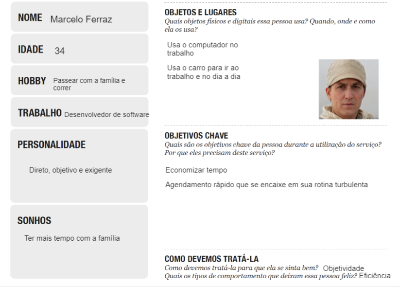
---

#### **Pedro**
  
---

### **Marina**
  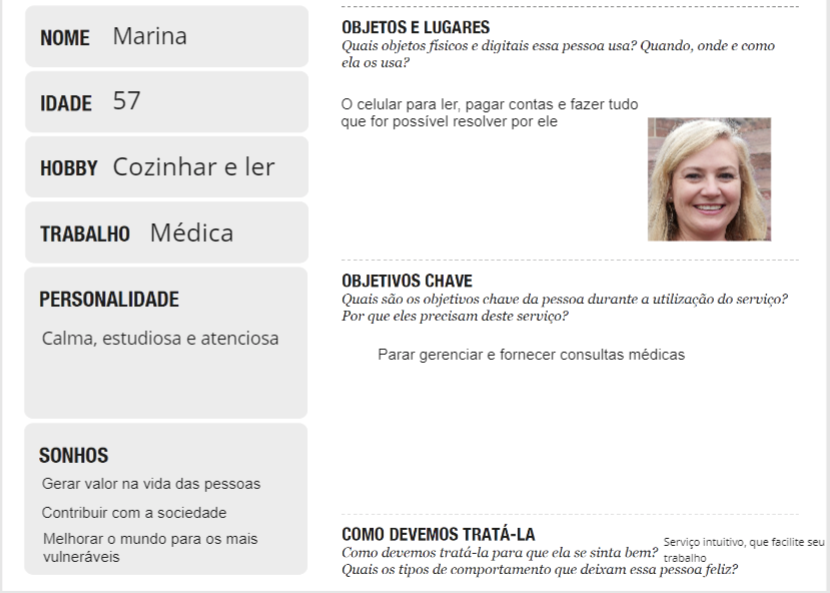

---

  
### **Josefa**
  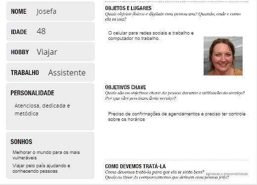

## Histórias de Usuários

Com base na análise das personas forma identificadas as seguintes histórias de usuários:

|EU COMO... `PERSONA`| QUERO/PRECISO ... `FUNCIONALIDADE`             |PARA ... `MOTIVO/VALOR`                                           |
|--------------------|------------------------------------------------|------------------------------------------------------------------|
|Marcelo Ferraz      | Agendar consultas online                       | Para economizar tempo evitando o deslocamento até a clinica      |
|Pedro               | Selecionar uma clínica/hospital de preferência | Para escolher o local mais adequado para mim                     |
|Marina              | Gerir as consultas por meio da internet        | Para facilitar a gestão das consultas e otimizar meu trabalho    |
|Marcelo Ferraz      | Marcar consultas em horário e dia especifico   | Para se adequar à minha rotina                                   |
|Marcelo Ferraz      | Escolher um médico de preferência              | Para ser atendido por um médico que me recomendaram ou conhecido |
|Pedro               | Confirmação de dados durante o agendamento     | Para evitar a entrada de dados incorretos                        |
|Josefa               | Visualização dos agendamentos do dia     | Para planejar as consultas     |
|Josefa               | Visualização das confirmações    | Para organizar a genda |

## Requisitos

As tabelas que se seguem apresentam os requisitos funcionais e não funcionais que detalham o escopo do projeto.

### Requisitos Funcionais

|ID    | Descrição do Requisito  | Prioridade |
|------|-----------------------------------------|----|
|RF-001| Permitir que o usuário faça login | ALTA |
|RF-002| Permitir que o usuário faça cadastro | ALTA |
|RF-003| Permitir que o usuário visualize o cadastro | ALTA |
|RF-004| Permitir que o usuário valide os dados | ALTA |
|RF-005| Permitir que o usuário edite os dados | ALTA |
|RF-006| Permitir que o usuário selecione o tipo de atendimento | ALTA |
|RF-007| Permitir que o usuário  envie carteira do convenio | ALTA |
|RF-008| Permitir que o usuário  envie pedido médico | ALTA |
|RF-009| Permitir que o usuário selecione o tipo de atendimento | BAIXA |
|RF-010| Permitir que o usuário selecione a especialidade | MÉDIA |
|RF-011| Permitir que o usuário selecione a clinica de preferência | ALTA |
|RF-012| Permitir que o usuário selecione a profissional de preferência | MÉDIA |
|RF-013| Permitir que o usuário selecione uma data | ALTA |
|RF-014| Permitir que o usuário selecione um horário | ALTA |
|RF-015| Permitir que o usuário selecione avalie o atendimento | BAIXA |
|RF-016| Permitir que o usuário administrador selecione uma data para atendimento| BAIXA |
|RF-017| Permitir que o usuário administrador selecione um horário para dar inicio ao atendimento| BAIXA |
|RF-018| Permitir que o usuário administrador finalize o atendimento| BAIXA |
|RF-019| Permitir que o usuário administrador selecione e visualize os arquivos do paciente | BAIXA |

### Requisitos não Funcionais

|ID     | Descrição do Requisito  |Prioridade |
|-------|-------------------------|----|
|RNF-001| O sistema deve ser responsivo para rodar em um dispositivos móvel  | MÉDIA |
|RNF-002| O sistema deve ser hospedado no github pages | MÉDIA |
|RNF-003| O sistema deve funcionar também como PWA | BAIXA |
|RNF-004| O sistema deve garantir a segurança dos dados através de criptografia SSL/TLS | ALTA |
|RNF-005| O sistema deve ter um tempo de resposta inferior a 2 segundos para qualquer transação | ALTA |
|RNF-006| O sistema deve suportar pelo menos 1000 usuários simultâneos sem degradação de desempenho | ALTA |

## Restrições

O projeto está restrito pelos itens apresentados na tabela a seguir.

|ID| Restrição                                             |
|--|-------------------------------------------------------|
|01| Não pode ser desenvolvido um módulo de backend        |
|02| O projeto deverá ser entregue no final do semestre letivo, não podendo extrapolar a data de *Julho de 2024.*  |
|03| Todos da equipe devem desenvolver uma funcionalidade de ponta a ponta  |
|04| Não podem ser subcontratados desenvolvedores  |
|05| Não pode ser ultilizado nenhumn frameworrk de frontend |
|06| Devem ser utilizadas apenas as linguagens de marcação, estilização e programação HTML, CSS e JavaScript |

# Projeto de Interface

O projeto de interface do sistema de agendamento de consultas médicas foi cuidadosamente desenvolvido para oferecer uma experiência de usuário intuitiva e acessível. Priorizamos uma navegação clara e simples, com menus bem organizados e botões de ação evidentes, garantindo que usuários de todas as idades e habilidades tecnológicas possam utilizar o sistema sem dificuldades. A interface é responsiva, adaptando-se perfeitamente a diferentes dispositivos e tamanhos de tela, o que é essencial para garantir o acesso universal. Além disso, utilizamos cores suaves e ícones explicativos para facilitar a identificação rápida das funções disponíveis, como agendar, reagendar ou cancelar consultas, contribuindo para uma gestão eficiente do tempo tanto dos pacientes quanto dos profissionais de saúde.

## User Flow
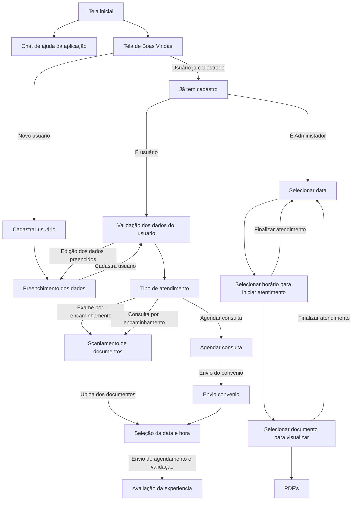

## Wireframes
Fluxos de uso:
  - Fluxo de agendamento de consulta
    - Login e validação
    - Seleção do tipo de atendimento
    - Agendar uma consulta
    - Agendamento 
    - Seleção de data
    - Agendar um exame
    - Consulta por encaminhamento médico
    - Envio de documentos
  - Fluxo de horários do médico/clinica
    - Seleção data
    - Seleção de horário
    - Selecione documento para visualização
    - PDFs de paciente

### Fluxo Agendamento
#### **Tela inicial**
 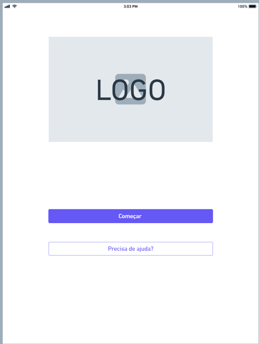

#### **Tela de opção de cadastro ou login**
 

#### **Tela de login** 
Identificação do tipo de usuário para enviar para a tela correta 
- Administardor - Tela de horários e consultas
- Usuario - tela de agendamento e cadastro

#### **Tela de cadastro de Usuário** 
Inserção dos dados de usuário para cadastro
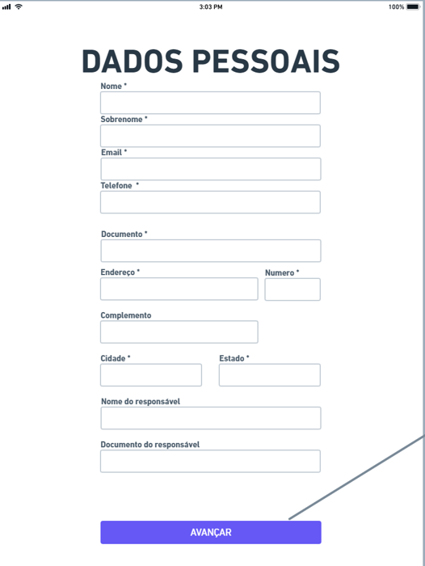

#### **Validação dos dados** 
Validação dos dados inseridos da tela de cadastro para verificação das informações

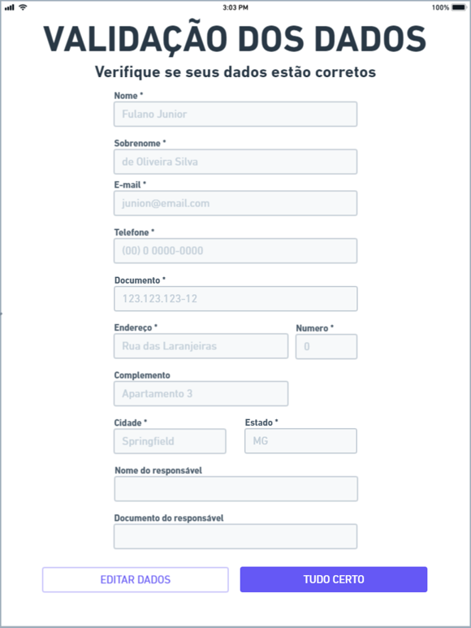

#### **Seleção do tipo de atendimento** 
Usuário seleciona o tipo de atendimento que vai continuar.
 - Agendamento de consulta
 - Agendamento de exame
 - Agendamento de consulta por encaminhamento médico

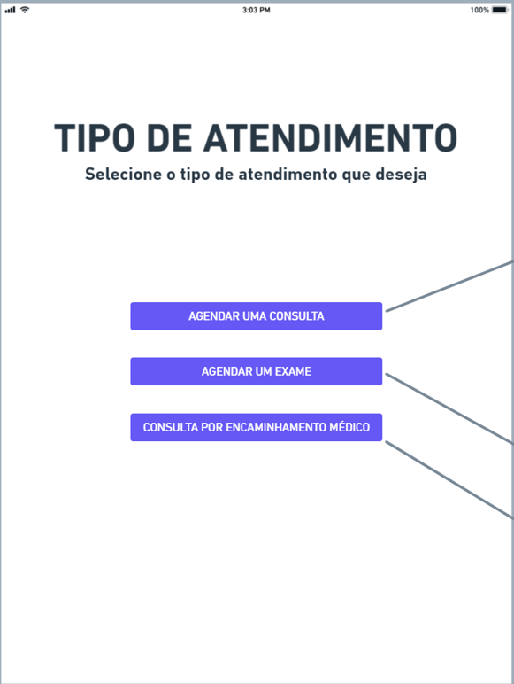

#### **Envio de documentos** 
 Envio dos documentos da consula de encaminhamento
 - Carterinha de convênio
 - Enviar pedido médico do encaminhamento
 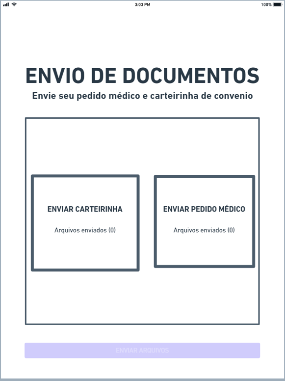

#### **Agendar consulta sem encaminhamento** 
 Seleção do agendamento de consulta sem encaminhamento
 - Tipo de agendamento
 - Especialidade desejada
 - Clinica de preferência (Opcional)
 - Profissional de preferência (Opcional)
 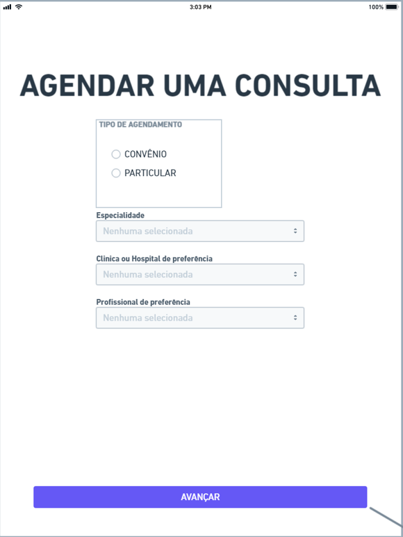

#### **Horários disponíveis** 
 Seleção do dia e horário disponiveis
 - Seleção da data disponível desejada
 - Seleção do horário disponível desejado
 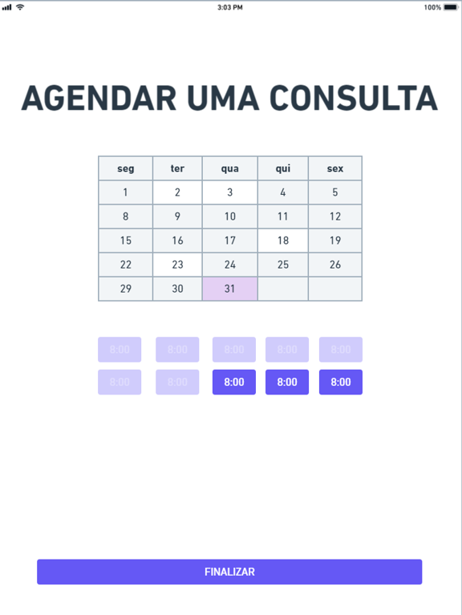

#### **Avaliação** 
 Avaliação de experiência do atendimento
 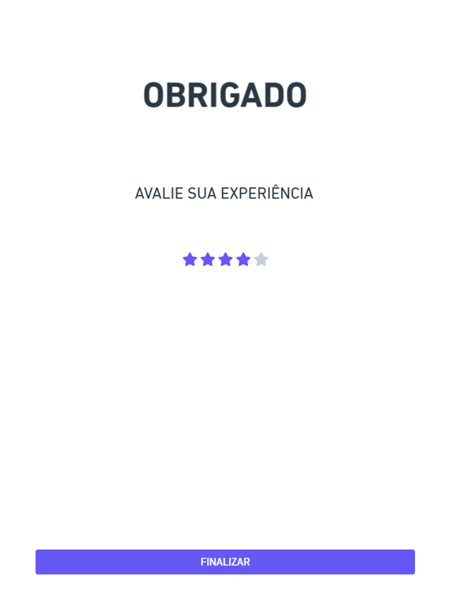

### Fluxo Clinica/Médico
#### **Avaliação** 
 Avaliação de experiência do atendimento
 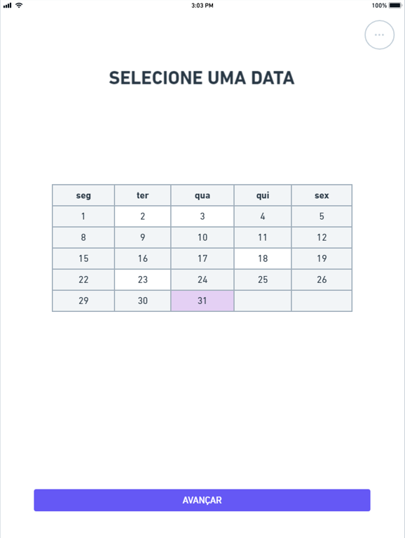

# Metodologia

No desenvolvimento do nosso projeto, adotamos uma abordagem ágil utilizando o framework Scrum, complementado pelo processo de Design Thinking. Utilizamos cerimônias do Scrum como Sprint Planning e mantivemos o foco nas necessidades dos usuários através de etapas de empatia, definição e ideação. Para gerenciar e rastrear nosso progresso, empregamos ferramentas como Github Projects, utilizamos o GitHub para a gestão de configuração do projeto, utilizamos o WhatsApp e Discord para comunicação e votação de funcionalidades.

A divisão dos status de atividades foram:

  - Todo: Tarefas que ainda não foram iniciadas.
  - In Progress: Tarefas que foram iniciadas e estão sendo executadas.
  - Inpedment: Tarefas que foram iniciadas, mas por algum motivo tem algo bloqueando sua conclusão.
  - Done: Tarefas que foram concluídas.

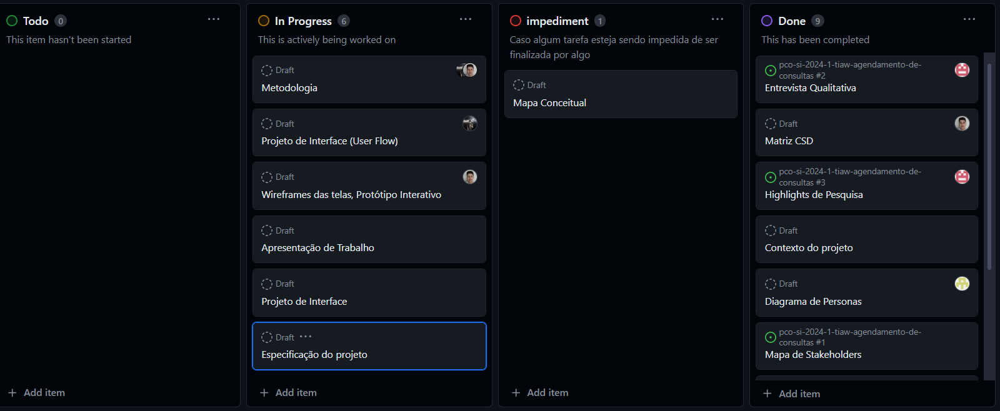

## Divisão de Papéis

As tarefas foram levantas em conjunto e divididas sob demanda na maior parte do tempo, mas inicialmente foi dividido por uma votação de tarefas levando em consideração a complexidade de cada tarefa, e as habilidades de cada integrante.

Kayque: Apresentação do Trabalho e Slides. Mapa de Stakeholders.
Talles: Mural de possibidades, Proposta de Valor e Mapa de Priorização.
Christian: Diagrama de personas, Entrevista Qualitativa, Estórias de Usuário.
Yuri: Entrevista Qualitativa, Highlits de Pesquisa.
João: Wireframes, Matriz CSD, Relatório tecnico, Contexto do Projeto, Projeto de Interface, Fluxo de Usuário.

Todos: BrainStorm

## Ferramentas

| Ambiente  | Plataforma              |Link de Acesso |
|-----------|-------------------------|---------------|
|Processo de Design Thinkgin  | Miro |  <https://miro.com/app/board/uXjVNjO9Ezo=/> |
|Repositório de código | GitHub | <https://github.com/ICEI-PUC-Minas-PCO-SI/pco-si-2024-1-tiaw-agendamento-de-consultas> |
|Hospedagem do site | Heroku |  <https://XXXXXXX.herokuapp.com> |
|Protótipo Interativo |  Figma | [Figma](https://www.figma.com/proto/FTo5F6hFRDaLCtbXbtlQYt/Untitled?type=design&node-id=1-2&scaling=min-zoom&page-id=0%3A1&starting-point-node-id=1%3A2&show-proto-sidebar=1>) |

## Controle de Versão

>
> O projeto segue a seguinte convenção para o nome de branchs:
>
> - `main`: versão estável já testada do software
> - `feature-#`: funcionalidade em desenvolvimento
> - `dev`: versão de desenvolvimento do software
> - `bugfix`: Correção de erro em teste
> - `hotfix`: Correção de erro em produção
>

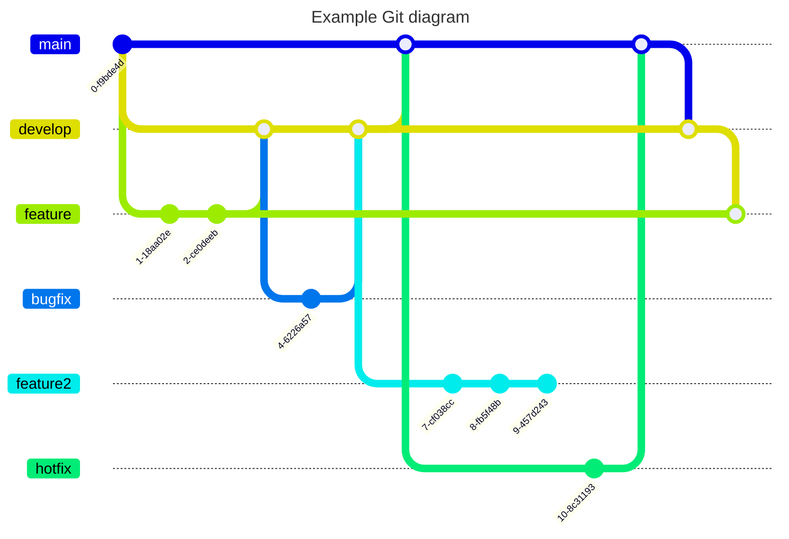

# Projeto da Solução

Esse projeto foi feito com o objetivo de criar uma plataforma acesssível tanto do computador quanto do celular para a marcação de consultas pelos pacientes e a gerência de consultas por parte dos médicos onde quer que eles estejam de forma rápida e simples.

## Tecnologias Utilizadas

Abaixo estão as tecnologias e ferramentas utilizadas no desenvolvimento do Agendaí:

**HTML** - Para estruturar as páginas  
**CSS** - Para estilizar as páginas  
**JavaScript** - Para adicionar dinamismo às páginas e acessar outros serviços externos como o Firebase
**Bootstrap** - Para estilizar as páginas
**Firebase** - Para armazenamento de dados
**Visual Studio Code** - Para fazer os códigos em si
**GitHub Pages** - Para hospedar a aplicação  

  

**Tela Inicial**  
  
Usuário tem as opções de continuar para poder então cadastrar/logar, ou a opção de pedir ajuda

**Tela de boas-vindas**  
  
Botão de cadastro e de login

**Tela de login**  
  
Inputs de texto para login(e-mail) e senha e um botão para avançar

**Tela de selecionar data (médico)**  
  
Calendário que, ao clicar em um dia específico, seleciona o dia. Um botão para avançar.

**Tela de horários (médico)**  
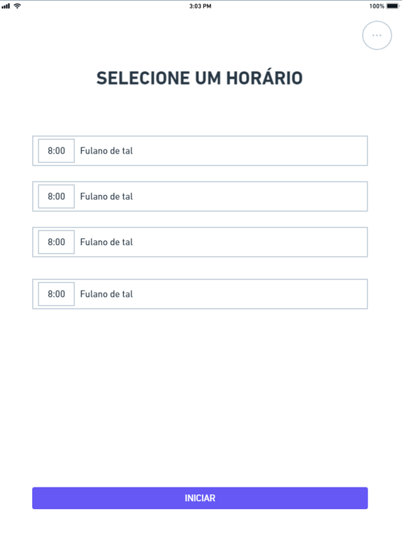  
Exibe os horários de consultas com o nome do paciente ao lado, possibilitando selecionar uma consulta específica de um dia específico.

**Tela de documentos (médico)**  
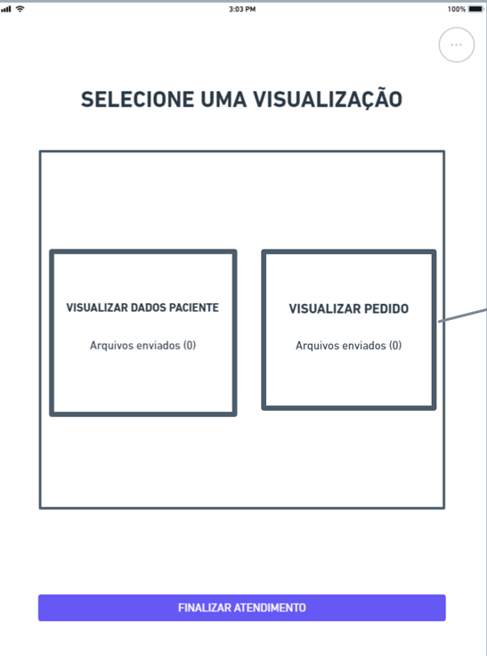  
Exibe dois botões, um para ver os dados do paciente e outro para ver o pedido, além disso exibe um botão para finalizar.

**Tela de dados pessoais**  
  
Exibe vários inputs referentes a dados pessoais do usuário, permitindo a alteração/cadastro dos mesmos, exibe também um botão para avançar

**Tela de confirmação de dados pessoais**  
  
Exibe os dados pessoais inseridos anteriormente e dois botões, um para confirmar esses dados e outro para editar os dados.

**Tela de tipo de atendimento**  
  
Exibe três botões, um botão para agendar uma consulta, um botão para agendar um exame e um botão para agendar uma consulta por encaminhamento médico.

**Tela de agendamento de consulta**  
  
Exibe um input para selecionar se a consulta será particular ou via convênio, e inputs para definir a especialidade, clínica/hospital de preferência, e profissional de preferência. Além disso, há um botão para avançar.

**Tela de envio de documentos**  
  
Exibe 1 ou mais botões de envio de documentos, dependendo da solicitação anterior. Sendo 2 para carteirinha e pedido médico, ou 1 só para carteirinha.

**Tela de seleção de data e horário**  
  
Exibe um calendário para a seleção da data desejada para marcar a consulta e botões dinâmicos que mostram os horários disponíveis na data selecionada.

**Tela de avaliação da experiência**  
  
Exibe 5 estrelas clicáveis, para a avaliação da experiência pelo usuário. Possui um botão para finalizar.  

**Interação do usuário com o sistema**  
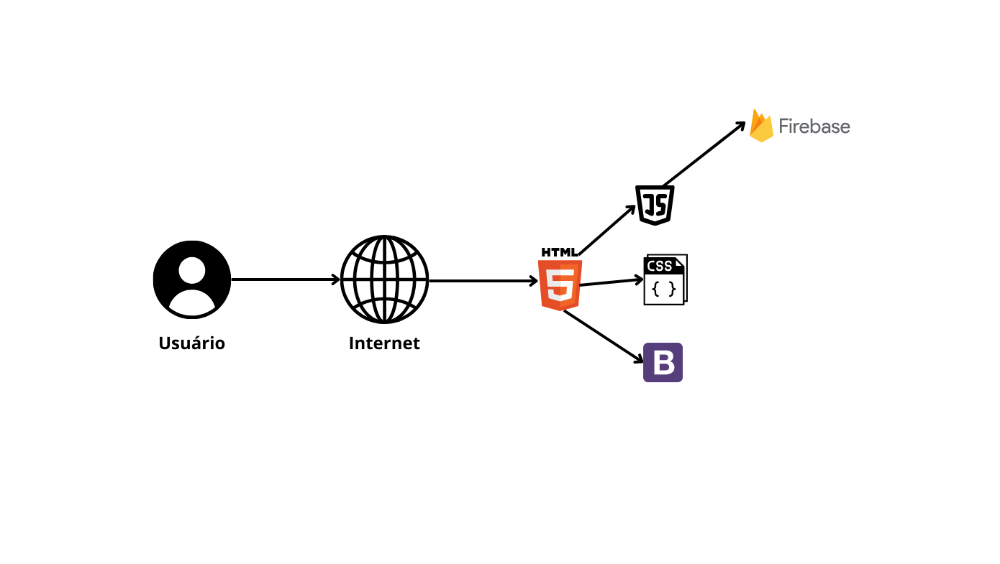

**Diagrama Userflow**

<!-- > Descreva aqui qual(is) tecnologias você vai usar para resolver o seu
> problema, ou seja, implementar a sua solução. Liste todas as
> tecnologias envolvidas, linguagens a serem utilizadas, serviços web,
> frameworks, bibliotecas, IDEs de desenvolvimento, e ferramentas.
> Apresente também uma figura explicando como as tecnologias estão
> relacionadas ou como uma interação do usuário com o sistema vai ser
> conduzida, por onde ela passa até retornar uma resposta ao usuário.
>
> Inclua os diagramas de User Flow, esboços criados pelo grupo
> (stoyboards), além dos protótipos de telas (wireframes). Descreva cada
> item textualmente comentando e complementando o que está apresentado
> nas imagens. -->

## Arquitetura da solução

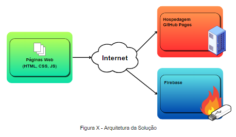
#### 1. Navegador:
**1.1** - Tecnologias Utilizadas:
- HTML;
- CSS;
- JavaScript;
- BootStrap;
- Firebase;

**1.2** - Funcionalidades:
- Interface
  - Utilizamos os recursos HTML, CSS e Framework Bootstrap para a estilização e padronização das páginas;
  - Utilizamos o JavaScript para a responsividade dos elementos, integração com o firebase, e para fazer a funcionalidade de componentes como os calendários das páginas de agendamentos.

**1.3** - Armazenamento:
- Todo o armazenamento de conteúdos foi feito utilizando o firebase.
  - ID's;
  - Nome de usuários;
  - Endereços;
  - Hospitais;
  - Credenciais de acesso(email's/senhas);
  - Documentos;

#### 2. Internet:
**2.1** - Hospedagem:
- O sistema escolhido para a hospedagem da aplicação foi o **GitHub Pages**;
- O banco de dados da aplicação foi feito por meio do **Firebase**.

**2.2** - Fluxo de dados:
- Leitura de Itens:
  - O navegador envia o requisito para o Firebase, e busca dados como documentração, nomes, médicos com a especialidade escolhida e nomes dos hospitais;
- Escrita de Itens:
  - O navegador faz a requisição para o banco do Firebase que por sua vez retorna os dados solicitados.

#### Integração:

**Firebase:**
Utilizamos a api do firebase para pegar e armazenar as informações de hospitais, consultas, pacientes e médicos no firebase.

# Avaliação da Aplicação

As avaliações realizadas no Agendai foram feitas para garantir uma melhor usabilidade e compatibilidade para os usuários. Segue abaixo os cenários utilizados para a realização dos testes.

# Cenários de Testes

Os cenarios abaixo foram escolhidos para mostrar se o sistema estária totalmente integrado com a API do Firebase e traria todos os resultados esperados para um bom funcionamento da aplicação.

## Plano de Testes

Escolhemos alguns modelos de testes para verificar o funcionamento da aplicação:

>  1. Criando nova conta:
> > - **Funcionalidade:** Criar nova conta de usuário;
> > - **Usuários:** Administradores(médicos e assistentes) / Usuários comuns(pacientes); 
> > - **Ferramentas:** Testes manuais / inspeção por meio da DevTools do Google.
>  2. Login / Logout:
> > - **Funcionalidade:** Entrar ou sair da sessão iniciada;
> > - **Usuários:** Administradores(médicos e assistentes) / Usuários comuns(pacientes);
> > - **Ferramentas:** Testes manuais / inspeção por meio da DevTools do Google.
>  3. Selecionar horário e paciente marcado:
> > - **Funcionalidades:**
> > > - Selecionar uma data no calendário;
> > > - Escolher um paciente marcado no dia;
> > > - Exibir a documentação encaminhada pelo paciente;
> > - **Usuários:** Administradores(médicos e assistentes)
> > - **Ferramentas:** Testes manuais / inspeção por meio da DevTools do Google.
>  4. Validação de dados:
> > - **Funcionalidades:** Verificar se os dados antes antes preenchidos pelo pacientes continuam os mesmos e atualizados;
> > - **Usuários:** Usuários comuns(pacientes);
> > - **Ferramentas:** Testes manuais / inspeção por meio da DevTools do Google.
>  5. Tipo de agendamento:
> > - **Funcionalidades:** Escolher o tipo de consulta que o usuário deseja marcar;
> > - **usuários:** Usuários comuns(pacientes);
> > - **Ferramentas:** Testes manuais / inspeção por meio da DevTools do Google;
>  6. Envio de documentos:
> > - **Funcionalidades:** Encaminhar documentos como carteirinha de convênios e pedidos médicos;
> > - **Usuários:** Usuários comuns(pacientes);
> > - **Ferramentas:** Testes manuais / inspeção por meio da DevTools do Google.
>  7. Agendar consulta:
> > - **Funcionalidades:**
> > > - Escolher dia;
> > > - Escolher horário;
> > > - Agendar a consulta;
> > - **Usuários:** Usuário comum(pacientes);
> > - **Ferramentas:** Testes manuais / inspeção por meio da DevTools do Google.
>  8. Feedback:
> > - **Funcionalidades:** Avaliação do usuário sobre o uso da aplicação;
> > - **Usuários:** Usuário comum(pacientes);
> > - **Ferramentas:** Testes manuais / inspeção por meio da DevTools do Google.

## Ferramentas de Testes (Opcional)

Para realizar os testes utilizamos de meios que facilitariam o processo de teste para a equipe.

> #### 1 - Testes manuais
> > Fizemos os seguintes testes manuais na aplicação:
> > > - Criar novos usuários;
> > > - Envios de documentos;
> > > - Realizar a marcação de horários para usuários;
> > > - Olhar se as marcações aparecem para o administrador(médico/assistente);
> > > - Fazer o feedback e ver se o mesmo está sendo armazenado.
>
> #### 2 - Outras ferramentas
> > Também utilizamos de outras ferramentas para a realização dos testes:
> > - DevTools do Google para a inspeção de caminhos.

## Registros de Testes

......  COLOQUE AQUI O SEU TEXTO ......

<!-- > Discorra sobre os resultados do teste. Ressaltando pontos fortes e
> fracos identificados na solução. Comente como o grupo pretende atacar
> esses pontos nas próximas iterações. Apresente as falhas detectadas e
> as melhorias geradas a partir dos resultados obtidos nos testes. -->

# Referências

Documentação do Firebase:
- https://firebase.google.com/docs?hl=pt-br

Documentação do JavaScript:
- https://developer.mozilla.org/pt-BR/docs/Web/JavaScript
- https://www.w3schools.com/js/

Documentação do Bootstrap:
- https://getbootstrap.com/docs/5.3/getting-started/introduction/
